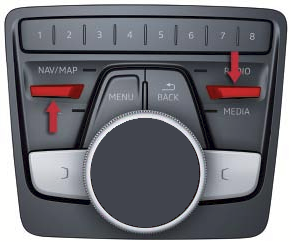

# Audi MMI

# Key combinations

| Model | REM (Red Engineering Menu) | GEM (Green Engineering Menu) | Reboot | Screenshot |
|----|:---|----|----|----|
| **A4/A5/Q5 MY 2017-2020** |   |   |   |   |
| **A4 (8W) manual gearbox** |   |   |   |   |
| **TT/R8** \n **A3 MY2016-2020** |   |   |   |   |
| **A3** \n **MY2012-2016** |   |   |   |   |
| **Q7 MY2014-2020** |   |   |   |   |
| **A6/A7 MY2015-2018** |   |   |   |   |

\
# Copy screenshots to SD

To create a screenshot, the lower left function key and the lower right function key must be pressed together. The screenshots are saved on the hard disk of the MMI unit. In order to copy the screenshots to SD card 1, the hidden menu must be activated (see Hidden Menu).

Then carry out the following steps in the hidden menu:

```
Select "production"
Select "debugging_prod"
Select "Copy MMX / RCC CoF, ErL & ScS (only AU) to SD1"
wait until the copying process is finished ("Copying files to ... done")
```

The screenshots (and log files) are now on the card in `SD1`, in a directory (e.g. `01_Export_20160913_115634`).

\
# References

<https://www.motor-talk.de/blogs/area-51/codierungen-erweiterungen-umbauten-an-meinem-audi-a6-4g-fl-t5468122.html>

[SSP 609 - EN - Audi A3 _13.pdf](../../assets/3baec121-46ad-42d8-a36f-6e1bac04e363.pdf)

[SSP 648 Audi Second-generation Modular Infotainment System.pdf](../../assets/23d2b4e5-129c-41db-a398-406ea44eea94.pdf)

\
\
