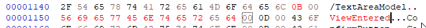
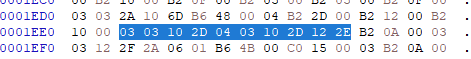

# JAVA HMI PatchesV2:

Documentation of some more or less ordered  HMI Research…

\
Golden Rules if you want so spent time patching HMI Files.

\

1. Every file that you touch might brick your unit or at least the HMI. Make backups.
2. Have a second access to the MIB2 that allows you to access root console in order to remove/replace files that you tried to patch and are at some point bricking your HMI. You might not have access to the GEM any more in order to replace Files that make your unit stuck
3. When patchingfr Skins, always have a working original copy of the  Skin, so that you can choose the working skin in Testmenu or in emergency via  VCDS/VCP coding.
4. Do JXE patching in  small steps and test often. 
5. Do a reboot every time! Otherwise you might replace the files but it is somehow cached  and you still see your first version  of the patch…. this is a hard lesson learned. It seems it is not sufficient to just switch Skins. I had an initial idea that did not seem to work, but weeks and several other failed  attempts later  it turned out i ended up with initial idea should have worked and i had to re-implement it again and it worked after a clean boot.
6. automate steps for testing to avoid dumb handling errors and have a decent testing experience. Having a Ethernet connection makes this comfortable and avoids scraping good patches because of improper testing/handling:

   
    1. automatically JXE2JAR your patched file
    2. automatically decompile your JAR with CFR
    3. Diff your new java file created from patched JXE and compare it to the Java from original JXE
    4. decide if you want to test the patch
    5. in case of Skin changes: automatically pack the patched JXE back to viewhandler.zip
    6. login to console  and 

       mount disk writable
    7. upload files via FTP
    8. log into console and  unmount
    9. reboot on console
   10. \
7. Do a “zero” run of your setup before you start editing the JXE. Files from  different Skins might not be interchangeable. I involuntarily confused JXE viewhandler files coming from Skin X and tried to integrate them in Skin Y. So the Patch supposedly did not work, as it was already breaking because of other inconsistencies in the first place.

\
## Prerequisites JXE2JAR

JAR and JXE are zip files with 0 compression. 

JXE is just a Intel invented  speed & size optimised JAR containing Java bytecode. 

You usually can unzip every jar or JXE file. 

JXE will only contain a rom.classes file. Due to patching the JXE bytes, the ZIP built in CRC Check fails and will invalidate/ delete rom.classes file und unzipping  or break JXE2JAR. Luckily MIB2 does not waste time on CRC checking because of speed reasons.

So you won’t be able to decompile a once binary patched JXE with JXE2JAR out of the box.

you might patch your python zip library( not nice) , do a monkey patch by locally overwriting the ZipExtFile._update_crc function. Or easier in JXE2JARs jxe.py you delete the expected CRC by calling  “ZipFileExt._expected_crc= None”  before a rom.read function is called. 

P.S. normal zip tools might delete files that failed CRC check during unpacking. 7-zip does not delete immediately.

\
\
\
# How to Patch HMI behaviour/ Skins: (Example: Remove “External Data Transfer Disclaimer” on Smartphone connection)

In the last Article i showed how to  patch real HMI code, which is complicated because of IFS  etc…

This time i want to remove a Popup different/easier way that not only has a Simple Confirmation/OK Button with no attached function, but a Popup with Cancel + Confirm Button. I was annoyed by the “External Data Transfer” Popup that shows every time i connect my Smartphone for Android Auto. Might be my Phone specific Issue, that i have to pair AA very often( in every new Lifecycle)…..

This time i cant remove just the Event triggering the Popup as the Connection Process will not continue if the OK Button was not pressed

\
Skins are a little bit  easier to patch:

Every Skin folder /tsd/hmi/Resources/SkinX contains a viewhandler.zip 

This ZIP file contains a bunch of JXE files. Every JXE file seems to correspond to a HMI Screen or Popup/Overlay

How to find the the needed JXE file:

In Developer Testmode activate  “Blue Overlay”

Navigate to desired Menu/Page that you want to maniupulate

Read the name of the  desired Popup / Screen like “PO_SMI_CONFIRM_EXTERNAL_DATA_TRANSFER”

Find the corresponding  “short name”/ filename of the popup: Search all files in viewhandler.zip for the occurrence of string “PO_SMI_CONFIRM_EXTERNAL_DATA_TRANSFER”

Here you will find e.g. Pscedt.jxe, so Pscedt is the “Short name” of the popup. You might find infos in the Logfiles ( e.g. on SD card) about this popup searching for the short name.

\
Run  JXE2JAR 

run CFR in order to get a readable JAVA file.

\
See that in with initWidgets() in my case 

this.cd0.widgets\[0\] contains the Popupview

this.cd0.widgets\[4\] contains the Cancel button

this.cd0.widgets\[7\] contains the OK Button 

\
notice that registerOutEvents() attaches EventsNumbers to the Button Elements:

>  protected void registerOutEvents() {
>
>         WidgetController widgetController = this.cd0.widgets\[4\].getController();
>
>         widgetController.setOutEventMapping("released", -1);
>
>         widgetController = this.cd0.widgets\[7\].getController();
>
>         widgetController.setOutEventMapping("released", -329544375);
>
>     }

\
You will find out that “released” is used 4 times in Java code but only once in JXE. \nThis means they all use the same string reference!\nWhen you change the Text in JXE, it will change all occurrences. \nYou can only replace the text can only be replaced with a same size text or with a shorter one.

If you want a shorter text, change the length counter of there String  before the Text

 

but as the next String starts right after, you can not write more text, without breaking internal references. 

**If you try to insert Bytes, the rest of the instructions also move  and all JXE internal Offset References to constants and Functions do no longer match! the JXE will not be usable any more and the HMI will crash/freeze as soon as the HI tries to load&show the Popup.**

\
I already learned by looking at other popups /viewhandler files, that there are other eventnames like press, pressed, release, released, ViewEntered, ViewLeft, timerExpired etc….. But NOT every event name is used for every “Widget” Type!

\
So i seems i want to send Event -319544375 automatically instead of pressing OK (“released” OK button) by myself.

\
so lets try “ViewEntered”, as it should be called when the popup/view opens.

unfortunately “released” is too short to fit the text “ViewEntered”.

(String)"CancelLabel" in the init function does not seem to have much technical use, maybe only for logging. so lets try to reuse this.

 

do a test and decompile the patched JXE, now the init function changed. 

Do a MIB2 test, the Popup still works.

 Why? Lets have a look on the JAR Bytecode now. 

You can use Eclipse IDE and import the JAR , as the source code is unavailable, it will show bytecode.

In the initWidget function we see

 

\
\
\
so “CancelLabel”/ now “ViewEntered” is constant 47 dec but it is not 0x2D but 0x2E ( zero is first element)

[https://en.wikipedia.org/wiki/List_of_Java_bytecode_instructions](/doc/httpsenwikipediaorgwikilist_of_java_bytecode_instructions-USjxuKpjFN) tells us 

ldc  is 0x12

bipush is 0x10 and takes one byte, and so on.

So if you assemble the bytes you should find the exact match

if you did not find it lets take just more code  above/ below

 

\
So lets see what we really want to change and look on the desired endresult

\
 so lets swap the first ldc reference from \[56\](released) to \[47\](cancelLabel now “ViewEntered”)

you can spot Line/Byte 16+18 and 42+44  from the code above here:

 and attach the same event as for the widget 7 (confirm button)  by swapping the ldc reference \[57\] to \[58\]

\
As the “ViewEntered” Event is probably only triggered by a View/Popup we must not assigning it to Widget 4 ( Cancel button), but to PopupView Widget 0 by swapping the iconst_4 to iconst_0 in Line/Byte Position 7

Result:

\
 This is all done by looking up the command values like iconst_4, aaload, invokeinterface etc.. and thus finding the correct occurrence in the JXE binary data.

Always do a decompile of your current changes to see if your change was successful and if you hit the right spot, and diff the new  java file against the original version like shown above

\
do little steps  so that you can revert fast, and from time to time test on the unit if your changes did not break the whole JXE if it gets too complicated.

\
Try it out now: The Popup will appear and soon  vanish like someone pressed OK. The Data Connection is established, without further  popup  OK interaction by the user

\
\
\
\
\
\
\
\
\
\
\
\
\
\
\
\
\
\
\
\
\
\
\
\
