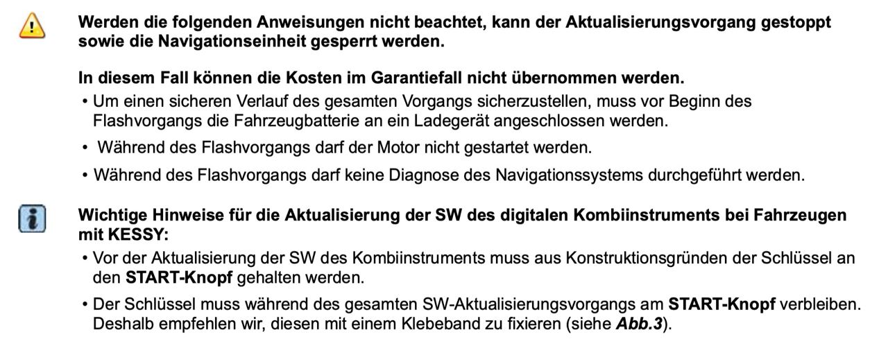

# Kessy & Updates

> [!WARNING]
> If your car is equipped with keyless system (a.k.a. KESSY) you need to be extra sure that the key is detected by the car during update procedure. Exiting the car with the key in your pocket will turn the ignition off, abort the update procedure, and create a huge mess.
> [!TIP]
> Tape the key to the receiver antenna in the vehicle ( marked with a key symbol). Usually located on the steering column, dashboard or center console.
\
> **If the following instructions are not followed properly, the update process might stop causing the navigation unit to be locked out.**
>
> **In this case, the costs cannot be covered in the event of a warranty claim.**
>
> * In order to ensure a safe course of the entire process, before the start of the flashing process, the vehicle battery should be connected to the charger.
> * The engine must not be started during the flashing process.
> * No diagnosis of the navigation system may be carried out during the flashing process.
>
>   \
>
> **Important information for updating the SW of the digital instrument cluster for vehicles with KESSY:**
>
> * Before updating the SW of the instrument cluster, the key must be placed on the **START button**.
> * As the key must remain on the **START button** throughout the SW update process, we recommend fixing it with adhesive tape (see Fig. 3).

\
              

\
