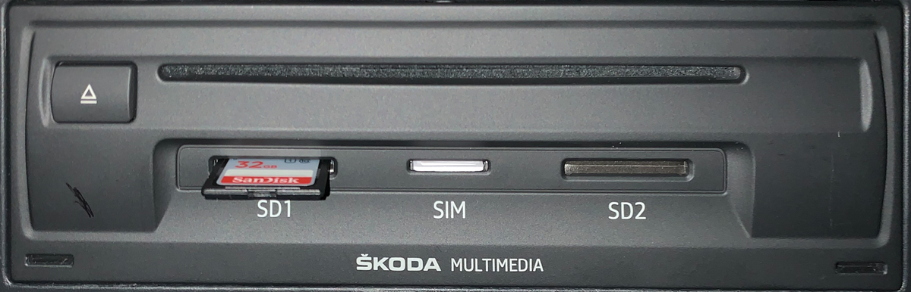
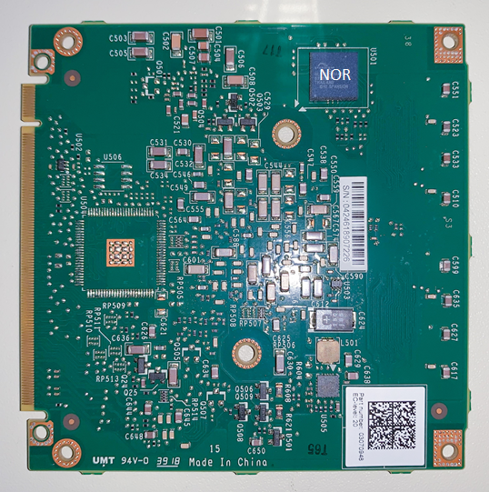
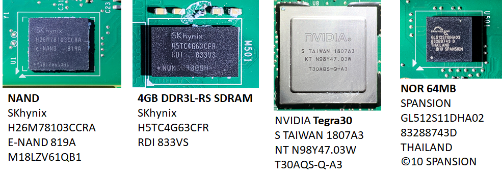

# Hardware MHI2

## Front cover

 

## RCC (Radio and Car Control) Mainboard / PCB (Printed Circuit Board)

 

\n          

## MMX (Multi Media eXtension) Mainboard / PCB (Printed Circuit Board)

 

 

\
 

## MMX - alternative PCB layouts

Over time different MMX PCB layouts can be found in MHI2 units (see also above) MMX Tegra30 Peripherals / Pinouts

[Tegra3_publicTRM_DP05644001_v03.pdf 23726005](../../assets/6f30c417-2c55-445a-bc10-68b2c120b8b4.pdf)

UARTD is exposed as the MMX UART console on the quadlock

NOR is at 0x48000000

USB0 is normal connection, USB3 is also configured in QNX

MMC/SD

* sda: 0x78000000 (SDMMC-1) bs=cd=D3:wp=V2:rs=V6
* sdb: 0x78000400 (SDMMC-3) bs=cd=D4:wp=V3:rs=V7

WLAN

* io-sdiorm-mib2 -p33 -c45000000 -h ioport=0x78000200,irq=47,inpclk=45000000

You can find more addresses in **/net/mmx/mnt/system/etc/boot/startup.sh**

> [!INFO]
> [MMX board on the MHI2Q](https://mibwiki.one/doc/mhi2q-qualcomm-OjscS91N94) does not have Tegra30, NOR and NAND chips. They are replaced with Qualcomm and eMMC chips.
\
