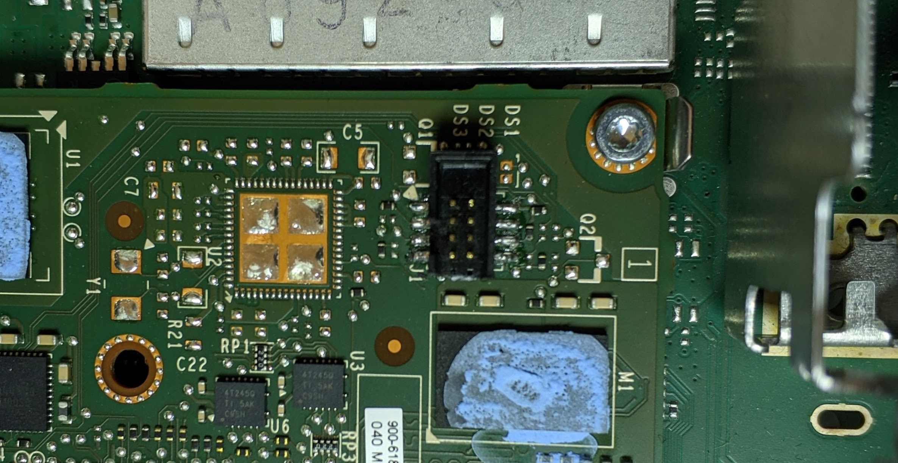
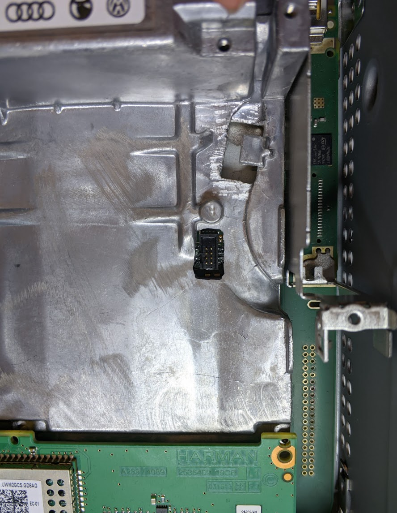

# JTAG connection to RCC or MMX

> [!INFO]
> Look for this pins in the corner of the [small MMX board](https://mibwiki.one/doc/hardware-mhi2-8AW9FZx7e0)
# MMX JTAG

 

## Adding debug header onto MMX board

As MMX JTAG pads don’t match a standard ARM debug header you will either directly solder to the pads or create an adapter cable.

For reference, most of standard programmers use standard 10- or 20-pin ARM header like these:

 

As MMX JTAG header is 8-pin 0.05" pitch connector, similar to the standard 10-pin ARM debugging header just with a different pinout, you can purchase [a standard 10-pin ARM connector](https://www.adafruit.com/product/4048), pull out the last two pins and solder the 8 remaining:

 

> [!INFO]
> The notch in the header housing is on the left side of this image / on the side of pin1 above. In this way pin 1 - 8 of a standard ARM jtag cable will match up with the pinout shown in the picture above.
As soon as you solder a header onto the oard, you will need to drill a hole in the heat sink of MMX cover:

 

\
## Connect to JTAG

Using [10-pin 2x5 Socket-Socket 1.27mm IDC (SWD) Cable - 150mm long](https://www.adafruit.com/product/1675) , [JTAG (2x10 2.54mm) to SWD (2x5 1.27mm) Cable Adapter Board](https://www.adafruit.com/product/2094) and [Premium Female/Female Jumper Wires - 20 x 6" (150mm)](https://www.adafruit.com/product/1950) you can create a JTAG cable like this:

 

Sure you can make it all simpler by soldering directly to JTAG pins on the board or create a simple direct cable to the JTAG header.

\
As soon as the connection is ready, proceed with the [recovery the MMX board if you’ve wiped your MMX NOR chip](/doc/mmx-jtagusb-recovery-of-wiped-nor-chip-qXiFPRTz1g), or just want to debug the code!