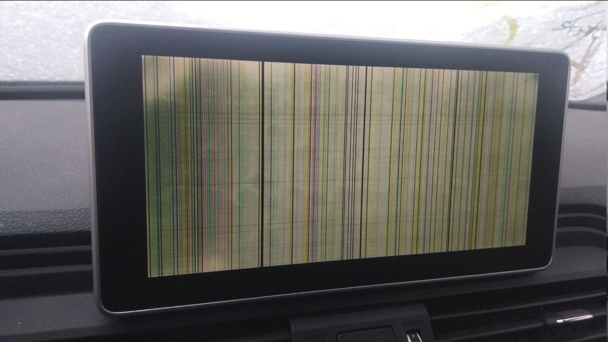

# format_nav_db on MHI2Q


> [!WARNING]
> This test was done on MHI2Q with the purpose to allow **format_nav_db** of **Most Incredible Bash** to work on **MHI2Q** units the same way as it successfully works on MHI2.
> 
> **The outcome of the test:**
> 
> Format worked but unit got into strange state which seems to be not related to the test itself so additional test is required.
\
on -f mmx mount

```
/ > on -f mmx mount
/net/mmx.mibhigh.net/dev/logos0t77 on /logosdisk type qnx4
/net/mmx.mibhigh.net/dev/mediadb0t77 on /fs/tmpfs type qnx4
/net/mmx.mibhigh.net/dev/sdb0t12 on /fs/sdb0 type dos (fat32)
/net/mmx.mibhigh.net/dev/sda0t12 on /fs/sda0 type dos (fat32)
/net/mmx.mibhigh.net/dev/sysramdisk0t77 on /ramdisk type qnx4
/net/mmx.mibhigh.net/dev/organizer0t77 on /organizerdisk type qnx4
/net/mmx.mibhigh.net/mnt/navdb/speech/sr/vde/EU/common_poicat/common_poicat.iso on /mnt/speech-sr-vde-common_poicat type cd (rrip)
/net/mmx.mibhigh.net/mnt/navdb/speech/sr/vde/EU/common/common.iso on /mnt/speech-sr-vde-common type cd (rrip)
/net/mmx.mibhigh.net/mnt/navdb/speech/sr/vde/EU/VaticanCity/VaticanCity.iso on /mnt/speech-sr-vde-VaticanCity type cd (rrip)
/net/mmx.mibhigh.net/mnt/navdb/speech/sr/vde/EU/Ukraine/Ukraine.iso on /mnt/speech-sr-vde-Ukraine type cd (rrip)
/net/mmx.mibhigh.net/mnt/navdb/speech/sr/vde/EU/Turkey/Turkey.iso on /mnt/speech-sr-vde-Turkey type cd (rrip)
/net/mmx.mibhigh.net/mnt/navdb/speech/sr/vde/EU/Switzerland/Switzerland.iso on /mnt/speech-sr-vde-Switzerland type cd (rrip)
/net/mmx.mibhigh.net/mnt/navdb/speech/sr/vde/EU/Sweden/Sweden.iso on /mnt/speech-sr-vde-Sweden type cd (rrip)
/net/mmx.mibhigh.net/mnt/navdb/speech/sr/vde/EU/Spain/Spain.iso on /mnt/speech-sr-vde-Spain type cd (rrip)
/net/mmx.mibhigh.net/mnt/navdb/speech/sr/vde/EU/Slovenia/Slovenia.iso on /mnt/speech-sr-vde-Slovenia type cd (rrip)
/net/mmx.mibhigh.net/mnt/navdb/speech/sr/vde/EU/Slovakia/Slovakia.iso on /mnt/speech-sr-vde-Slovakia type cd (rrip)
/net/mmx.mibhigh.net/mnt/navdb/speech/sr/vde/EU/Serbia/Serbia.iso on /mnt/speech-sr-vde-Serbia type cd (rrip)
/net/mmx.mibhigh.net/mnt/navdb/speech/sr/vde/EU/SanMarino/SanMarino.iso on /mnt/speech-sr-vde-SanMarino type cd (rrip)
/net/mmx.mibhigh.net/mnt/navdb/speech/sr/vde/EU/Russia/Russia.iso on /mnt/speech-sr-vde-Russia type cd (rrip)
/net/mmx.mibhigh.net/mnt/navdb/speech/sr/vde/EU/Romania/Romania.iso on /mnt/speech-sr-vde-Romania type cd (rrip)
/net/mmx.mibhigh.net/mnt/navdb/speech/sr/vde/EU/Portugal/Portugal.iso on /mnt/speech-sr-vde-Portugal type cd (rrip)
/net/mmx.mibhigh.net/mnt/navdb/speech/sr/vde/EU/Poland/Poland.iso on /mnt/speech-sr-vde-Poland type cd (rrip)
/net/mmx.mibhigh.net/mnt/navdb/speech/sr/vde/EU/Norway/Norway.iso on /mnt/speech-sr-vde-Norway type cd (rrip)
/net/mmx.mibhigh.net/mnt/navdb/speech/sr/vde/EU/Netherlands/Netherlands.iso on /mnt/speech-sr-vde-Netherlands type cd (rrip)
/net/mmx.mibhigh.net/mnt/navdb/speech/sr/vde/EU/Montenegro/Montenegro.iso on /mnt/speech-sr-vde-Montenegro type cd (rrip)
/net/mmx.mibhigh.net/mnt/navdb/speech/sr/vde/EU/Monaco/Monaco.iso on /mnt/speech-sr-vde-Monaco type cd (rrip)
/net/mmx.mibhigh.net/mnt/navdb/speech/sr/vde/EU/Moldova/Moldova.iso on /mnt/speech-sr-vde-Moldova type cd (rrip)
/net/mmx.mibhigh.net/mnt/navdb/speech/sr/vde/EU/Malta/Malta.iso on /mnt/speech-sr-vde-Malta type cd (rrip)
/net/mmx.mibhigh.net/mnt/navdb/speech/sr/vde/EU/Macedonia/Macedonia.iso on /mnt/speech-sr-vde-Macedonia type cd (rrip)
/net/mmx.mibhigh.net/mnt/navdb/speech/sr/vde/EU/Luxembourg/Luxembourg.iso on /mnt/speech-sr-vde-Luxembourg type cd (rrip)
/net/mmx.mibhigh.net/mnt/navdb/speech/sr/vde/EU/Lithuania/Lithuania.iso on /mnt/speech-sr-vde-Lithuania type cd (rrip)
/net/mmx.mibhigh.net/mnt/navdb/speech/sr/vde/EU/Liechtenstein/Liechtenstein.iso on /mnt/speech-sr-vde-Liechtenstein type cd (rrip)
/net/mmx.mibhigh.net/mnt/navdb/speech/sr/vde/EU/Latvia/Latvia.iso on /mnt/speech-sr-vde-Latvia type cd (rrip)
/net/mmx.mibhigh.net/mnt/navdb/speech/sr/vde/EU/Kosovo/Kosovo.iso on /mnt/speech-sr-vde-Kosovo type cd (rrip)
/net/mmx.mibhigh.net/mnt/navdb/speech/sr/vde/EU/Italy/Italy.iso on /mnt/speech-sr-vde-Italy type cd (rrip)
/net/mmx.mibhigh.net/mnt/navdb/speech/sr/vde/EU/Ireland/Ireland.iso on /mnt/speech-sr-vde-Ireland type cd (rrip)
/net/mmx.mibhigh.net/mnt/navdb/speech/sr/vde/EU/Iceland/Iceland.iso on /mnt/speech-sr-vde-Iceland type cd (rrip)
/net/mmx.mibhigh.net/mnt/navdb/speech/sr/vde/EU/Hungary/Hungary.iso on /mnt/speech-sr-vde-Hungary type cd (rrip)
/net/mmx.mibhigh.net/mnt/navdb/speech/sr/vde/EU/Greece/Greece.iso on /mnt/speech-sr-vde-Greece type cd (rrip)
/net/mmx.mibhigh.net/mnt/navdb/speech/sr/vde/EU/GreatBritain/GreatBritain.iso on /mnt/speech-sr-vde-GreatBritain type cd (rrip)
/net/mmx.mibhigh.net/mnt/navdb/speech/sr/vde/EU/Gibraltar/Gibraltar.iso on /mnt/speech-sr-vde-Gibraltar type cd (rrip)
/net/mmx.mibhigh.net/mnt/navdb/speech/sr/vde/EU/Germany/Germany.iso on /mnt/speech-sr-vde-Germany type cd (rrip)
/net/mmx.mibhigh.net/mnt/navdb/speech/sr/vde/EU/France/France.iso on /mnt/speech-sr-vde-France type cd (rrip)
/net/mmx.mibhigh.net/mnt/navdb/speech/sr/vde/EU/Finland/Finland.iso on /mnt/speech-sr-vde-Finland type cd (rrip)
/net/mmx.mibhigh.net/mnt/navdb/speech/sr/vde/EU/Estonia/Estonia.iso on /mnt/speech-sr-vde-Estonia type cd (rrip)
/net/mmx.mibhigh.net/mnt/navdb/speech/sr/vde/EU/Denmark/Denmark.iso on /mnt/speech-sr-vde-Denmark type cd (rrip)
/net/mmx.mibhigh.net/mnt/navdb/speech/sr/vde/EU/CzechRepublic/CzechRepublic.iso on /mnt/speech-sr-vde-CzechRepublic type cd (rrip)
/net/mmx.mibhigh.net/mnt/navdb/speech/sr/vde/EU/Cyprus/Cyprus.iso on /mnt/speech-sr-vde-Cyprus type cd (rrip)
/net/mmx.mibhigh.net/mnt/navdb/speech/sr/vde/EU/Croatia/Croatia.iso on /mnt/speech-sr-vde-Croatia type cd (rrip)
/net/mmx.mibhigh.net/mnt/navdb/speech/sr/vde/EU/Bulgaria/Bulgaria.iso on /mnt/speech-sr-vde-Bulgaria type cd (rrip)
/net/mmx.mibhigh.net/mnt/navdb/speech/sr/vde/EU/BosniaHerzegovina/BosniaHerzegovina.iso on /mnt/speech-sr-vde-BosniaHerzegovina type cd (rrip)
/net/mmx.mibhigh.net/mnt/navdb/speech/sr/vde/EU/Belgium/Belgium.iso on /mnt/speech-sr-vde-Belgium type cd (rrip)
/net/mmx.mibhigh.net/mnt/navdb/speech/sr/vde/EU/Belarus/Belarus.iso on /mnt/speech-sr-vde-Belarus type cd (rrip)
/net/mmx.mibhigh.net/mnt/navdb/speech/sr/vde/EU/Austria/Austria.iso on /mnt/speech-sr-vde-Austria type cd (rrip)
/net/mmx.mibhigh.net/mnt/navdb/speech/sr/vde/EU/Andorra/Andorra.iso on /mnt/speech-sr-vde-Andorra type cd (rrip)
/net/mmx.mibhigh.net/mnt/navdb/speech/sr/vde/EU/Albania/Albania.iso on /mnt/speech-sr-vde-Albania type cd (rrip)
/net/mmx.mibhigh.net/mnt/speech/tts/voices/speech-tts-pt-BR_female.iso on /mnt/speech-tts-pt-BR_female type cd (rrip)
/net/mmx.mibhigh.net/mnt/speech/tts/voices/speech-tts-pl-PL_female.iso on /mnt/speech-tts-pl-PL_female type cd (rrip)
/net/mmx.mibhigh.net/mnt/speech/tts/voices/speech-tts-en-US_female.iso on /mnt/speech-tts-en-US_female type cd (rrip)
/net/mmx.mibhigh.net/mnt/speech/tts/voices/speech-tts-it-IT_female.iso on /mnt/speech-tts-it-IT_female type cd (rrip)
/net/mmx.mibhigh.net/mnt/speech/tts/voices/speech-tts-nl-NL_female.iso on /mnt/speech-tts-nl-NL_female type cd (rrip)
/net/mmx.mibhigh.net/mnt/speech/tts/voices/speech-tts-ar-SA_male.iso on /mnt/speech-tts-ar-SA_male type cd (rrip)
/net/mmx.mibhigh.net/mnt/speech/tts/voices/speech-tts-tr-TR_male.iso on /mnt/speech-tts-tr-TR_male type cd (rrip)
/net/mmx.mibhigh.net/mnt/speech/tts/voices/speech-tts-fr-FR_female.iso on /mnt/speech-tts-fr-FR_female type cd (rrip)
/net/mmx.mibhigh.net/mnt/speech/tts/voices/speech-tts-ru-RU_female.iso on /mnt/speech-tts-ru-RU_female type cd (rrip)
/net/mmx.mibhigh.net/mnt/speech/tts/voices/speech-tts-es-ES_female.iso on /mnt/speech-tts-es-ES_female type cd (rrip)
/net/mmx.mibhigh.net/mnt/speech/tts/voices/speech-tts-pt-PT_female.iso on /mnt/speech-tts-pt-PT_female type cd (rrip)
/net/mmx.mibhigh.net/mnt/speech/tts/voices/speech-tts-de-DE_female.iso on /mnt/speech-tts-de-DE_female type cd (rrip)
/net/mmx.mibhigh.net/mnt/speech/tts/voices/speech-tts-hu-HU_female.iso on /mnt/speech-tts-hu-HU_female type cd (rrip)
/net/mmx.mibhigh.net/mnt/speech/tts/voices/speech-tts-de-DE_male.iso on /mnt/speech-tts-de-DE_male type cd (rrip)
/net/mmx.mibhigh.net/mnt/speech/tts/voices/speech-tts-sv-SE_female.iso on /mnt/speech-tts-sv-SE_female type cd (rrip)
/net/mmx.mibhigh.net/mnt/speech/tts/voices/speech-tts-en-GB_female.iso on /mnt/speech-tts-en-GB_female type cd (rrip)
/net/mmx.mibhigh.net/mnt/speech/tts/voices/speech-tts-es-MX_female.iso on /mnt/speech-tts-es-MX_female type cd (rrip)
/net/mmx.mibhigh.net/mnt/speech/tts/voices/speech-tts-no-NO_female.iso on /mnt/speech-tts-no-NO_female type cd (rrip)
/net/mmx.mibhigh.net/mnt/speech/tts/voices/speech-tts-en-GB_male.iso on /mnt/speech-tts-en-GB_male type cd (rrip)
/net/mmx.mibhigh.net/mnt/speech/tts/voices/speech-tts-cs-CZ_female.iso on /mnt/speech-tts-cs-CZ_female type cd (rrip)
/net/mmx.mibhigh.net/dev/emmc/boot0.18db1fc8-94a8-4e54-824e-9154a7e78389.0 on /mnt/slc0 type qnx6
/net/mmx.mibhigh.net/dev/emmc/boot1.e7b238d0-3010-4ee6-a677-8a4a4681ec9a.2 on /mnt/cinemo type qnx6
/net/mmx.mibhigh.net/dev/emmc/uda0.0fc63daf-8483-4772-8e79-3d69d8477de5.32 on /mnt/ota type qnx6
/net/mmx.mibhigh.net/dev/emmc/uda0.0fc63daf-8483-4772-8e79-3d69d8477de7.31 on /mnt/media type qnx6
/net/mmx.mibhigh.net/dev/emmc/uda0.0fc63daf-8483-4772-8e79-3d69d8477de6.18 on /mnt/navdb type qnx6
/net/mmx.mibhigh.net/dev/emmc/uda0.0fc63daf-8483-4772-8e79-3d69d8477de7.19 on /mnt/ols type qnx6
/net/mmx.mibhigh.net/dev/emmc/uda0.0fc63daf-8483-4772-8e79-3d69d8477de7.20 on /mnt/gecache type qnx6
/net/mmx.mibhigh.net/dev/emmc/uda0.0fc63daf-8483-4772-8e79-3d69d8477de7.21 on /mnt/adb type qnx6
/net/mmx.mibhigh.net/dev/emmc/uda0.0fc63daf-8483-4772-8e79-3d69d8477de7.22 on /mnt/icab type qnx6
/net/mmx.mibhigh.net/dev/emmc/uda0.0fc63daf-8483-4772-8e79-3d69d8477de7.23 on /mnt/mmebackup type qnx6
/net/mmx.mibhigh.net/dev/emmc/uda0.0fc63daf-8483-4772-8e79-3d69d8477de7.24 on /mnt/gracenotedb type qnx6
/net/mmx.mibhigh.net/dev/emmc/uda0.0fc63daf-8483-4772-8e79-3d69d8477de7.26 on /mnt/boardbook type qnx6
/net/mmx.mibhigh.net/dev/emmc/uda0.0fc63daf-8483-4772-8e79-3d69d8477de7.17 on /mnt/persist type qnx6
/net/mmx.mibhigh.net/dev/emmc/uda0.0fc63daf-8483-4772-8e79-3d69d8477de7.15 on /mnt/system type qnx6
/net/mmx.mibhigh.net/dev/emmc/uda0.0fc63daf-8483-4772-8e79-3d69d8477de7.25 on /mnt/speech type qnx6
/net/mmx.mibhigh.net/dev/emmc/uda0.0fc63daf-8483-4772-8e79-3d69d8477de7.27 on /mnt/app type qnx6
/net/mmx.mibhigh.net/mnt/app/eso/lib/icu.iso on /mnt/app/eso/lib/icudt58l type cd (rrip)
none on /proc/ham type qnx6
```

\
on -f mmx cat /net/mmx/etc/fstab

```bash
/ > on -f mmx cat /net/mmx/etc/fstab
/dev/mnand0t177    /mnt/app         qnx6   ro
/dev/fs0p1         /mnt/system      qnx6   ro
/dev/fs0p2         /mnt/persist     qnx6   rw
/dev/mnand0t178    /mnt/boardbook   qnx6   rw             #-T media -b 32768 -i 256
/dev/mnand0t178.1  /mnt/speech      qnx6   rw             #-T media -b 32768 -i 2048
/dev/mnand0t178.2  /mnt/gracenotedb qnx6   ro             #-T media -b 32768 -i 256
/dev/mnand0t178.3  /mnt/mmebackup   qnx6   ro             #-T media -b 32768 -i 2048
/dev/mnand0t178.4  /mnt/icab        qnx6   rw,alignio     #-T runtime -b 32768 -i 65536
/dev/mnand0t178.5  /mnt/adb         qnx6   rw             #-T media -b 4096 -i 32768
/dev/mnand0t178.6  /mnt/gecache     qnx6   rw,alignio     #-T runtime -b 16384 -i 8192
/dev/mnand0t178.7  /mnt/ols         qnx6   rw             #-T media -b 1024 -i 16384
/dev/mnand0t178.8  /mnt/navdb       qnx6   ro,alignio     #-T media -b 32768 -i 8192
/dev/mnand0t178.9  /mnt/media       qnx6   ro,alignio     #-T media -b 32768 -i 16384
/dev/mnand0t179    /mnt/ota         qnx6   rw             #-T runtime -b 32768 -i 4096
/dev/emmc/key      /mnt/cinemo      qnx6   ro             #-T media -b 4096 -i 512
/dev/emmc/slc0     /mnt/slc0        qnx6   rw             #-T media -b 4096 -i 512
```

\
### Crash

shell output:

```bash
...
1Badpathesolibfactorieslib_8d4f7cec-be0c-49b7-b1b6-1e3e4c26b847soinprocessthread130540204fileframeworksrcosalposixFileSyscxxline64
2InvalidpathspecifiedToomanylevelsofsymboliclinksorprefixeserrno90inprocessthread130540204fileframeworksrcosalposixFileSyscxxline63
unhandlederrorlinked
1Badpathesolibfactorieslib_8d4f7cec-be0c-49b7-b1b6-1e3e4c26b847soinprocessthread130540204fileframeworksrcosalposixFileSyscxxline64
2InvalidpathspecifiedToomanylevelsofsymboliclinksorprefixeserrno90inprocessthread130540204fileframeworksrcosalposixFileSyscxxline63
unhandlederrorlinked
1Badpathesolibfactorieslib_8d4f7cec-be0c-49b7-b1b6-1e3e4c26b847soinprocessthread130540204fileframeworksrcosalposixFileSyscxxline64
2InvalidpathspecifiedToomanylevelsofsymboliclinksorprefixeserrno90inprocessthread130540204fileframeworksrcosalposixFileSyscxxline63
nosuchpartition
unhandlederrorlinked
1Badpathesolibfactorieslib_8d4f7cec-be0c-49b7-b1b6-1e3e4c26b847soinprocessthread130540204fileframeworksrcosalposixFileSyscxxline64
2InvalidpathspecifiedToomanylevelsofsymboliclinksorprefixeserrno90inprocessthread130540204fileframeworksrcosalposixFileSyscxxline63
unhandlederrorlinked
1Badpathesolibfactorieslib_8d4f7cec-be0c-49b7-b1b6-1e3e4c26b847soinprocessthread130540204fileframeworksrcosalposixFileSyscxxline64
2InvalidpathspecifiedToomanylevelsofsymboliclinksorprefixeserrno90inprocessthread130540204fileframeworksrcosalposixFileSyscxxline63
unhandlederrorTheproxyisDEADinprocessthread130540201filesrc_rootframeworksrccommLifecyclecxxline42-▒▒▒▒▒▒▒▒▒▒▒▒▒▒▒▒▒▒▒▒▒▒▒▒▒▒▒▒▒▒▒▒▒▒▒▒▒▒▒▒▒▒▒▒▒▒▒▒▒▒▒▒▒▒▒▒▒▒▒▒▒▒▒▒▒▒▒▒▒▒▒▒▒▒▒▒▒▒▒▒▒▒▒▒▒▒▒▒▒▒▒▒▒▒▒▒▒▒▒▒▒▒▒▒▒▒▒▒▒▒▒▒▒▒▒▒▒▒▒▒▒▒▒▒▒▒▒▒▒▒▒▒▒▒▒▒▒▒▒▒▒▒▒▒▒▒▒▒▒▒▒▒▒▒▒▒▒▒▒▒▒▒▒▒▒▒▒▒▒▒▒▒▒▒▒▒▒▒▒▒▒▒▒▒▒▒▒▒▒▒▒▒▒▒▒▒▒▒▒▒▒▒▒▒▒▒▒▒▒▒▒▒▒▒▒▒▒▒▒▒▒▒▒▒▒▒▒▒▒▒▒▒▒▒▒▒▒▒▒▒▒▒▒▒▒▒▒▒▒▒▒▒▒▒▒▒▒▒▒▒▒▒▒▒▒▒▒▒▒▒▒▒▒▒▒▒▒▒▒▒▒▒▒▒▒▒▒▒▒▒▒▒▒▒▒▒▒▒▒▒▒▒▒▒▒▒▒▒▒▒▒▒.log: Invalid argument
/net/mmx/fs/sda0/apps/hex2ascii[67]: cannot create /net/mmx/fs/sda0/apps/../backup/logs/MUunhandlederrorlinked
1Badpathesolibfactorieslib_03171582-f255-4991-b8ae-83f90521c08bsoinprocessthread130540201fileframeworksrcosalposixFileSyscxxline64
2InvalidpathspecifiedToomanylevelsofsymboliclinksorprefixeserrno90inprocessthread130540201fileframeworksrcosalposixFileSyscxxline63
unhandlederrorlinked
1Badpathesolibfactorieslib_8d4f7cec-be0c-49b7-b1b6-1e3e4c26b847soinprocessthread130540205fileframeworksrcosalposixFileSyscxxline64
2InvalidpathspecifiedToomanylevelsofsymboliclinksorprefixeserrno90inprocessthread130540205fileframeworksrcosalposixFileSyscxxline63
unhandlederrorlinked
1Badpathesolibfactorieslib_8d4f7cec-be0c-49b7-b1b6-1e3e4c26b847soinprocessthread130540204fileframeworksrcosalposixFileSyscxxline64
2InvalidpathspecifiedToomanylevelsofsymboliclinksorprefixeserrno90inprocessthread130540204fileframeworksrcosalposixFileSyscxxline63
unhandlederrorlinked
1Badpathesolibfactorieslib_8d4f7cec-be0c-49b7-b1b6-1e3e4c26b847soinprocessthread130540204fileframeworksrcosalposixFileSyscxxline64
2InvalidpathspecifiedToomanylevelsofsymboliclinksorprefixeserrno90inprocessthread130540204fileframeworksrcosalposixFileSyscxxline63
unhandlederrorlinked
1Badpathesolibfactorieslib_8d4f7cec-be0c-49b7-b1b6-1e3e4c26b847soinprocessthread130540204fileframeworksrcosalposixFileSyscxxline64
2InvalidpathspecifiedToomanylevelsofsymboliclinksorprefixeserrno90inprocessthread130540204fileframeworksrcosalposixFileSyscxxline63
unhandlederrorlinked
1Badpathesolibfactorieslib_8d4f7cec-be0c-49b7-b1b6-1e3e4c26b847soinprocessthread130540204fileframeworksrcosalposixFileSyscxxline64
2InvalidpathspecifiedToomanylevelsofsymboliclinksorprefixeserrno90inprocessthread130540204fileframeworksrcosalposixFileSyscxxline63
unhandlederrorlinked
1Badpathesolibfactorieslib_8d4f7cec-be0c-49b7-b1b6-1e3e4c26b847soinprocessthread130540204fileframeworksrcosalposixFileSyscxxline64
2InvalidpathspecifiedToomanylevelsofsymboliclinksorprefixeserrno90inprocessthread130540204fileframeworksrcosalposixFileSyscxxline63
unhandlederrorlinked
1Badpathesolibfactorieslib_8d4f7cec-be0c-49b7-b1b6-1e3e4c26b847soinprocessthread130540204fileframeworksrcosalposixFileSyscxxline64
2InvalidpathspecifiedToomanylevelsofsymboliclinksorprefixeserrno90inprocessthread130540204fileframeworksrcosalposixFileSyscxxline63
...
```

and on unit

 Unit did not fully crash - RCC was still on and commands for formatting NavDB were still running on MMX. As per LOG file, the crash happend before umount was executed so it is not clear what exactly caused the crash.

\
code used to unmount navdb

```bash
umount -f /mnt/navdb
echo "y" | mkqnx6fs -T media -b 32768 -i 32768 /dev/mnand0t178.8 2>> $LOG
sleep 1
mount -t qnx6 /dev/mnand0t178.8 /mnt/navdb 2>> $LOG
sleep 1
```

\
This looks OK

```bash
MMX-delnavdb---->
Formatting Nav DB now...

All files on /dev/emmc/uda0.0fc63daf-8483-4772-8e79-3d69d8477de6.18 will be lost!
Confirm filesystem re-format (y) or (n): y
Format fs-qnx6: 1011709 blocks, 32768 inodes, 4 groups

All done!
Reboot Unit... press CTRL-C to abort!!!
```

\
NavDB was read only after reboot. Can be set to write and `test` file could be created and deleted

```bash
cd /mnt/navdb/
# ls
.        ..       .boot
# touch test
test: Read-only file system

# mount -uw /net/nav
mount: Can't remount /net/nav (type default)
mount: Possible reason: No route to host

# mount -uw /mnt/navdb/
# touch test
# ls
.        ..       .boot    test
# rm test
# ls
.        ..       .boot
```

\
```bash
ls -l /net/mmx/dev/emmc/
total 248708959
lrwxrwxrwx  1 root      root             54 Jan 01 00:08 DDR -> /dev/emmc/uda0.20a0c19c-286a-42fa-9ce7-f64c3226a794.30
lrwxrwxrwx  1 root      root             54 Jan 01 00:08 adb -> /dev/emmc/uda0.0fc63daf-8483-4772-8e79-3d69d8477de7.21
lrwxrwxrwx  1 root      root             54 Jan 01 00:08 app -> /dev/emmc/uda0.0fc63daf-8483-4772-8e79-3d69d8477de7.27
lrwxrwxrwx  1 root      root             54 Jan 01 00:08 bct -> /dev/emmc/boot1.5632eaf2-4ab0-536f-5eee-a7916a317e14.1
lrwxrwxrwx  1 root      root             54 Jan 01 00:08 boardbook -> /dev/emmc/uda0.0fc63daf-8483-4772-8e79-3d69d8477de7.26
brw-------  1 root      root         5,   0 Jan 01 00:00 boot0
brw-------  1 root      root         1,  42 Jan 01 00:00 boot0.18db1fc8-94a8-4e54-824e-9154a7e78389.0
brw-------  1 root      root         1,  43 Jan 01 00:00 boot0.2110f876-9e85-4537-be9e-734b1cd8847d.1
brw-------  1 root      root         5,   1 Jan 01 00:00 boot1
brw-------  1 root      root         1,  47 Jan 01 00:00 boot1.0fc63daf-8483-4772-8e79-3d69d8477de4.3
brw-------  1 root      root         1,  45 Jan 01 00:00 boot1.5632eaf2-4ab0-536f-5eee-a7916a317e14.1
brw-------  1 root      root         1,  44 Jan 01 00:00 boot1.a19f205f-ccd8-4b6d-8f1e-2d9bc24cffb1.0
brw-------  1 root      root         1,  46 Jan 01 00:00 boot1.e7b238d0-3010-4ee6-a677-8a4a4681ec9a.2
lrwxrwxrwx  1 root      root             54 Jan 01 00:08 cdt -> /dev/emmc/boot1.a19f205f-ccd8-4b6d-8f1e-2d9bc24cffb1.0
lrwxrwxrwx  1 root      root             53 Jan 01 00:08 eifs -> /dev/emmc/uda0.12345678-1234-1234-1234-123412341234.7
lrwxrwxrwx  1 root      root             54 Jan 01 00:08 fsg -> /dev/emmc/uda0.638ff8e2-22c9-e33b-8f5d-0e81686a68cb.28
lrwxrwxrwx  1 root      root             54 Jan 01 00:08 gecache -> /dev/emmc/uda0.0fc63daf-8483-4772-8e79-3d69d8477de7.20
lrwxrwxrwx  1 root      root             54 Jan 01 00:08 gracenotedb -> /dev/emmc/uda0.0fc63daf-8483-4772-8e79-3d69d8477de7.24
lrwxrwxrwx  1 root      root             54 Jan 01 00:08 grow -> /dev/emmc/boot1.0fc63daf-8483-4772-8e79-3d69d8477de4.3
lrwxrwxrwx  1 root      root             54 Jan 01 00:08 icab -> /dev/emmc/uda0.0fc63daf-8483-4772-8e79-3d69d8477de7.22
lrwxrwxrwx  1 root      root             54 Jan 01 00:08 ifs2 -> /dev/emmc/uda0.20117f86-e985-4357-b9ee-374bc1d8487d.13
lrwxrwxrwx  1 root      root             54 Jan 01 00:08 key -> /dev/emmc/boot1.e7b238d0-3010-4ee6-a677-8a4a4681ec9a.2
lrwxrwxrwx  1 root      root             54 Jan 01 00:08 lk -> /dev/emmc/uda0.12345678-1234-1234-1234-123412341234.12
lrwxrwxrwx  1 root      root             54 Jan 01 00:08 media -> /dev/emmc/uda0.0fc63daf-8483-4772-8e79-3d69d8477de7.31
lrwxrwxrwx  1 root      root             53 Jan 01 00:08 mifs -> /dev/emmc/uda0.400ffdcd-22e0-47e7-9a23-f16ed9382388.6
lrwxrwxrwx  1 root      root             54 Jan 01 00:08 mmebackup -> /dev/emmc/uda0.0fc63daf-8483-4772-8e79-3d69d8477de7.23
lrwxrwxrwx  1 root      root             54 Jan 01 00:08 navdb -> /dev/emmc/uda0.0fc63daf-8483-4772-8e79-3d69d8477de6.18
lrwxrwxrwx  1 root      root             54 Jan 01 00:08 ols -> /dev/emmc/uda0.0fc63daf-8483-4772-8e79-3d69d8477de7.19
lrwxrwxrwx  1 root      root             54 Jan 01 00:08 ota -> /dev/emmc/uda0.0fc63daf-8483-4772-8e79-3d69d8477de5.32
lrwxrwxrwx  1 root      root             54 Jan 01 00:08 padding -> /dev/emmc/boot0.2110f876-9e85-4537-be9e-734b1cd8847d.1
lrwxrwxrwx  1 root      root             54 Jan 01 00:08 persist -> /dev/emmc/uda0.0fc63daf-8483-4772-8e79-3d69d8477de7.17
lrwxrwxrwx  1 root      root             53 Jan 01 00:08 rpm -> /dev/emmc/uda0.098df793-d712-413d-9d4e-89d711772228.8
lrwxrwxrwx  1 root      root             53 Jan 01 00:08 rpm_bak -> /dev/emmc/uda0.12345678-1234-1234-1234-123412341234.9
lrwxrwxrwx  1 root      root             53 Jan 01 00:08 sbl1 -> /dev/emmc/uda0.dea0ba2c-cbdd-4805-b4f9-f428251c3e98.0
lrwxrwxrwx  1 root      root             53 Jan 01 00:08 sbl1_bak -> /dev/emmc/uda0.12345678-1234-1234-1234-123412341234.1
lrwxrwxrwx  1 root      root             53 Jan 01 00:08 sbl2 -> /dev/emmc/uda0.8c6b52ad-8a9e-4398-ad09-ae916e53ae2d.2
lrwxrwxrwx  1 root      root             53 Jan 01 00:08 sbl2_bak -> /dev/emmc/uda0.12345678-1234-1234-1234-123412341234.3
lrwxrwxrwx  1 root      root             53 Jan 01 00:08 sbl3 -> /dev/emmc/uda0.05e044df-92f1-4325-b69e-374a82e97d6e.4
lrwxrwxrwx  1 root      root             53 Jan 01 00:08 sbl3_bak -> /dev/emmc/uda0.12345678-1234-1234-1234-123412341234.5
lrwxrwxrwx  1 root      root             54 Jan 01 00:08 slc0 -> /dev/emmc/boot0.18db1fc8-94a8-4e54-824e-9154a7e78389.0
lrwxrwxrwx  1 root      root             54 Jan 01 00:08 spare -> /dev/emmc/uda0.20117f86-e985-4357-b9ee-374bc1d8487d.33
lrwxrwxrwx  1 root      root             54 Jan 01 00:08 speech -> /dev/emmc/uda0.0fc63daf-8483-4772-8e79-3d69d8477de7.25
lrwxrwxrwx  1 root      root             54 Jan 01 00:08 splash -> /dev/emmc/uda0.0fc63daf-8483-4772-8e79-3d69d8477de3.16
lrwxrwxrwx  1 root      root             54 Jan 01 00:08 ssd -> /dev/emmc/uda0.2c86e742-745e-4fdd-bfd8-b6a7ac638772.29
lrwxrwxrwx  1 root      root             54 Jan 01 00:08 swdl -> /dev/emmc/uda0.20117f86-e985-4357-b9ee-374bc1d8487d.14
lrwxrwxrwx  1 root      root             54 Jan 01 00:08 system -> /dev/emmc/uda0.0fc63daf-8483-4772-8e79-3d69d8477de7.15
lrwxrwxrwx  1 root      root             54 Jan 01 00:08 tz -> /dev/emmc/uda0.a053aa7f-40b8-4b1c-ba08-2f68ac71a4f4.10
lrwxrwxrwx  1 root      root             54 Jan 01 00:08 tz_bak -> /dev/emmc/uda0.12345678-1234-1234-1234-123412341234.11
brw-------  1 root      root         4,   0 Jan 01 00:00 uda0
brw-------  1 root      root         1,  12 Jan 01 00:00 uda0.05e044df-92f1-4325-b69e-374a82e97d6e.4
brw-------  1 root      root         1,  16 Jan 01 00:00 uda0.098df793-d712-413d-9d4e-89d711772228.8
brw-------  1 root      root         1,  24 Jan 01 00:00 uda0.0fc63daf-8483-4772-8e79-3d69d8477de3.16
brw-------  1 root      root         1,  40 Jan 01 00:00 uda0.0fc63daf-8483-4772-8e79-3d69d8477de5.32
brw-------  1 root      root         1,  26 Jan 01 00:00 uda0.0fc63daf-8483-4772-8e79-3d69d8477de6.18
brw-------  1 root      root         1,  23 Jan 01 00:00 uda0.0fc63daf-8483-4772-8e79-3d69d8477de7.15
brw-------  1 root      root         1,  25 Jan 01 00:00 uda0.0fc63daf-8483-4772-8e79-3d69d8477de7.17
brw-------  1 root      root         1,  27 Jan 01 00:00 uda0.0fc63daf-8483-4772-8e79-3d69d8477de7.19
brw-------  1 root      root         1,  28 Jan 01 00:00 uda0.0fc63daf-8483-4772-8e79-3d69d8477de7.20
brw-------  1 root      root         1,  29 Jan 01 00:00 uda0.0fc63daf-8483-4772-8e79-3d69d8477de7.21
brw-------  1 root      root         1,  30 Jan 01 00:00 uda0.0fc63daf-8483-4772-8e79-3d69d8477de7.22
brw-------  1 root      root         1,  31 Jan 01 00:00 uda0.0fc63daf-8483-4772-8e79-3d69d8477de7.23
brw-------  1 root      root         1,  32 Jan 01 00:00 uda0.0fc63daf-8483-4772-8e79-3d69d8477de7.24
brw-------  1 root      root         1,  33 Jan 01 00:00 uda0.0fc63daf-8483-4772-8e79-3d69d8477de7.25
brw-------  1 root      root         1,  34 Jan 01 00:00 uda0.0fc63daf-8483-4772-8e79-3d69d8477de7.26
brw-------  1 root      root         1,  35 Jan 01 00:00 uda0.0fc63daf-8483-4772-8e79-3d69d8477de7.27
brw-------  1 root      root         1,  39 Jan 01 00:00 uda0.0fc63daf-8483-4772-8e79-3d69d8477de7.31
brw-------  1 root      root         1,   9 Jan 01 00:00 uda0.12345678-1234-1234-1234-123412341234.1
brw-------  1 root      root         1,  19 Jan 01 00:00 uda0.12345678-1234-1234-1234-123412341234.11
brw-------  1 root      root         1,  20 Jan 01 00:00 uda0.12345678-1234-1234-1234-123412341234.12
brw-------  1 root      root         1,  11 Jan 01 00:00 uda0.12345678-1234-1234-1234-123412341234.3
brw-------  1 root      root         1,  13 Jan 01 00:00 uda0.12345678-1234-1234-1234-123412341234.5
brw-------  1 root      root         1,  15 Jan 01 00:00 uda0.12345678-1234-1234-1234-123412341234.7
brw-------  1 root      root         1,  17 Jan 01 00:00 uda0.12345678-1234-1234-1234-123412341234.9
brw-------  1 root      root         1,  21 Jan 01 00:00 uda0.20117f86-e985-4357-b9ee-374bc1d8487d.13
brw-------  1 root      root         1,  22 Jan 01 00:00 uda0.20117f86-e985-4357-b9ee-374bc1d8487d.14
brw-------  1 root      root         1,  41 Jan 01 00:00 uda0.20117f86-e985-4357-b9ee-374bc1d8487d.33
brw-------  1 root      root         1,  38 Jan 01 00:00 uda0.20a0c19c-286a-42fa-9ce7-f64c3226a794.30
brw-------  1 root      root         1,  37 Jan 01 00:00 uda0.2c86e742-745e-4fdd-bfd8-b6a7ac638772.29
brw-------  1 root      root         1,  14 Jan 01 00:00 uda0.400ffdcd-22e0-47e7-9a23-f16ed9382388.6
brw-------  1 root      root         1,  36 Jan 01 00:00 uda0.638ff8e2-22c9-e33b-8f5d-0e81686a68cb.28
brw-------  1 root      root         1,  10 Jan 01 00:00 uda0.8c6b52ad-8a9e-4398-ad09-ae916e53ae2d.2
brw-------  1 root      root         1,  18 Jan 01 00:00 uda0.a053aa7f-40b8-4b1c-ba08-2f68ac71a4f4.10
brw-------  1 root      root         1,   8 Jan 01 00:00 uda0.dea0ba2c-cbdd-4805-b4f9-f428251c3e98.0
```

\
```bash
# /net/mmx/bin/fdisk /net/mmx/dev/emmc/uda0 info
Physical disk characteristics: (/net/mmx/dev/emmc/uda0)
    Disk type        : Direct Access (0)
    Cylinders        : 60704
    Heads            : 64
    Sectors/Track    : 32
    Total Sectors    : 124321792
    Sector size      : 512
Partition table information:
    0: (238) beg(h=0,s=2,c=0) end(h=63,s=32,c=2097151) off=1, size=4294967295
    1: (0) beg(h=0,s=0,c=0) end(h=0,s=0,c=0) off=0, size=0
    2: (0) beg(h=0,s=0,c=0) end(h=0,s=0,c=0) off=0, size=0
    3: (0) beg(h=0,s=0,c=0) end(h=0,s=0,c=0) off=0, size=0
signature1=0x55, signature2=0xAA

net/mmx/bin/fdisk /net/mmx/dev/emmc/boot1 info
Physical disk characteristics: (/net/mmx/dev/emmc/boot1)
    Disk type        : Direct Access (0)
    Cylinders        : 8
    Heads            : 64
    Sectors/Track    : 32
    Total Sectors    : 16384
    Sector size      : 512
Partition table information:
    0: (238) beg(h=0,s=2,c=0) end(h=63,s=32,c=2097151) off=1, size=4294967295
    1: (0) beg(h=0,s=0,c=0) end(h=0,s=0,c=0) off=0, size=0
    2: (0) beg(h=0,s=0,c=0) end(h=0,s=0,c=0) off=0, size=0
    3: (0) beg(h=0,s=0,c=0) end(h=0,s=0,c=0) off=0, size=0
signature1=0x55, signature2=0xAA

# /net/mmx/bin/fdisk /net/mmx/dev/emmc/uda0 show

     _____OS_____     Start      End     ______Number______   Size    Boot
     name    type    Cylinder  Cylinder  Cylinders   Blocks

1.   nonQNX   238          0    2097151   2097152   4294967295  2097151 MB
2.   ------   ---   --------   --------   -------  --------  -----
3.   ------   ---   --------   --------   -------  --------  -----
4.   ------   ---   --------   --------   -------  --------  -----

# /net/mmx/bin/fdisk /net/mmx/dev/emmc/boot0 show

     _____OS_____     Start      End     ______Number______   Size    Boot
     name    type    Cylinder  Cylinder  Cylinders   Blocks

1.   nonQNX   238          0    2097151   2097152   4294967295  2097151 MB
2.   ------   ---   --------   --------   -------  --------  -----
3.   ------   ---   --------   --------   -------  --------  -----
4.   ------   ---   --------   --------   -------  --------  -----

# /net/mmx/bin/fdisk /net/mmx/dev/emmc/boot1 show

     _____OS_____     Start      End     ______Number______   Size    Boot
     name    type    Cylinder  Cylinder  Cylinders   Blocks

1.   nonQNX   238          0    2097151   2097152   4294967295  2097151 MB
2.   ------   ---   --------   --------   -------  --------  -----
3.   ------   ---   --------   --------   -------  --------  -----
4.   ------   ---   --------   --------   -------  --------  -----
```

\
