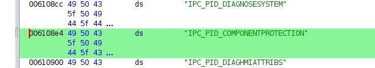

# Some notes about the executable files

**Some references for the component protection:**

Actually the binary called CPU_HMI.exe allocated has got references to ANTITHEFT protection references as u can see in this photo:\n\nBut for now we dont know how to patch it…

\
 

[CPU_HMI_OR.EXE 6448640](../../assets/6d531708-6cf9-4a23-84d9-eaf7011a5b21.exe)

\
